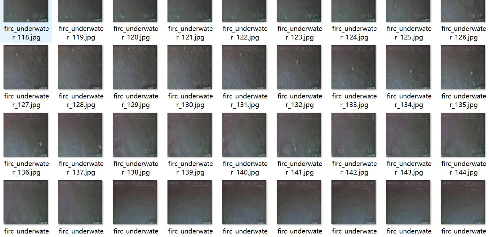
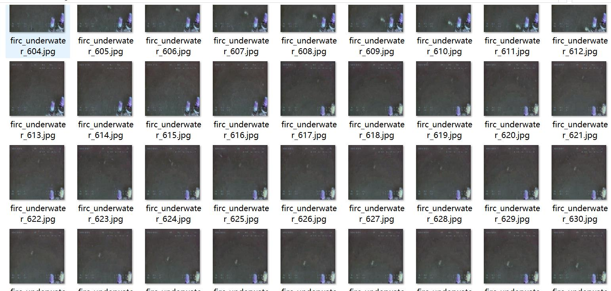
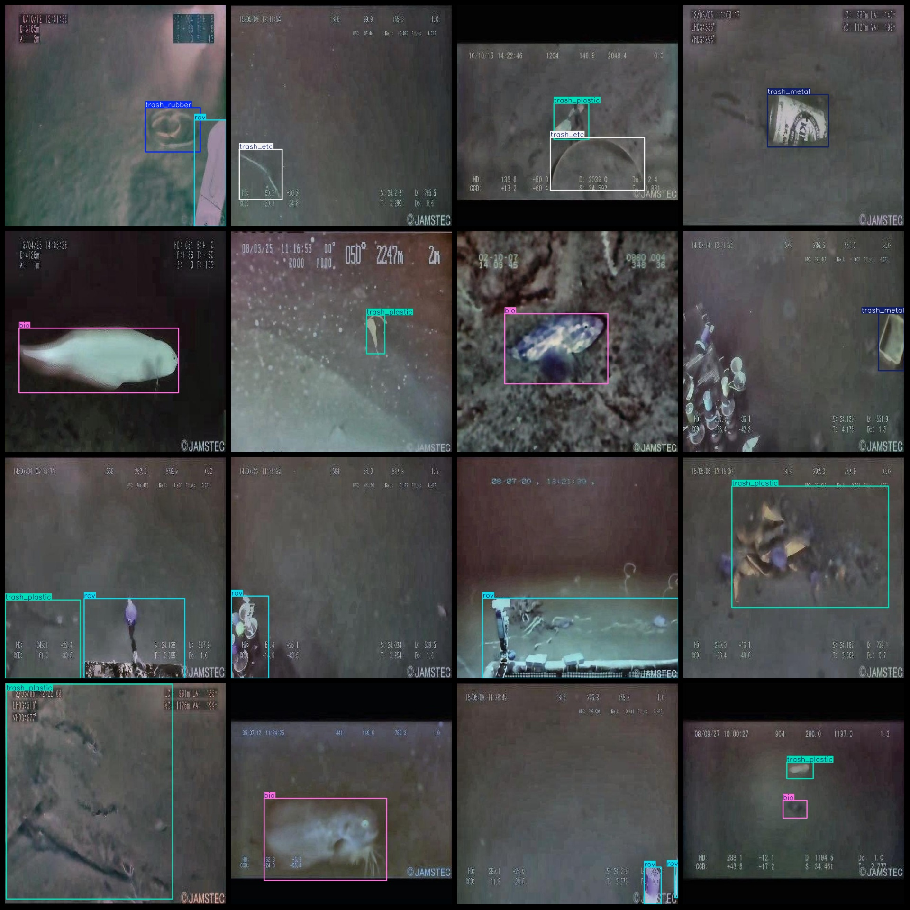
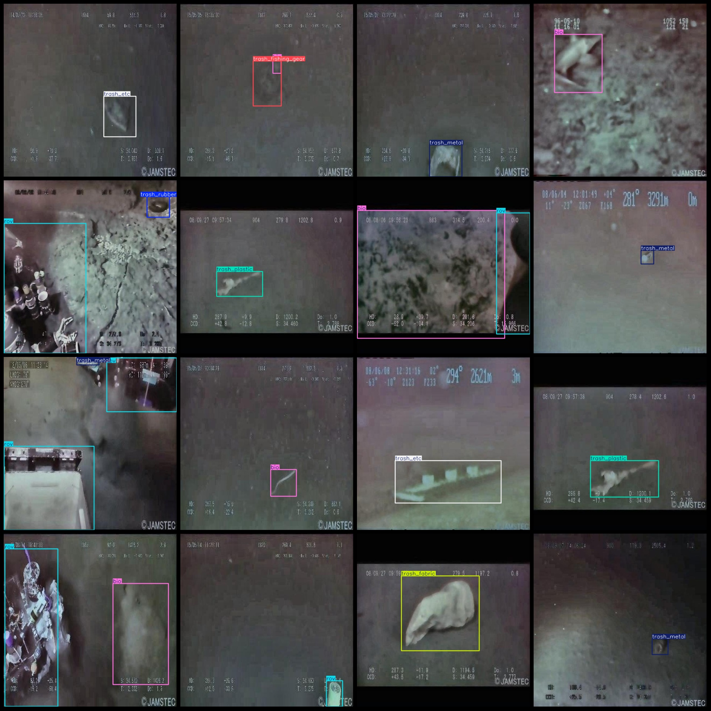

# Underwater ROV-Viewed Waste Detection Dataset with VOC+YOLO Format: 7265 Images in 10 Categories

Dataset format: Pascal VOC format + YOLO format (without split path in txtfile, only containing jpgimage and corresponding VOC format xmlfile and yolo format txtfile)
number of images: 7265  
annotation count: 7265  
annotation count: 7265  
annotationnumber of classes: 10  
Annotation class names: ["bio", "rov", "trash_etc", "trash_fabric", "trash_fishing_gear", "trash_metal", "trash_paper", "trash_plastic", "trash_rubber", "trash_wood"]
boxes per class:   
bio box count = 2809  
rov box count = 3513  
trash_etc box count = 2053  
trash_fabric box count = 336  
trash_fishing_gear box count = 196  
trash_metal box count = 1137  
trash_paper box count = 206  
trash_plastic box count = 1876  
trash_rubber box count = 142  
trash_wood box count = 340
total boxes: 12608  
image resolution: 640x640  
Use annotation tool: labelImg  
Annotation rules: draw a rectangle around the class  
Important notes: dataset needs to be divided into training validation test sets, which should be done by yourself.  
Special statement: this dataset does not guarantee the accuracy of the trained model or weight file.  
Image preview:
## Images

Here is a pay link on Stripe ( https://buy.stripe.com/3cs8yP7sY87d0vu9AB ). Please contact me lonlonago@foxmail.com after funding $89, and I will send you a complete data files , thank you!

